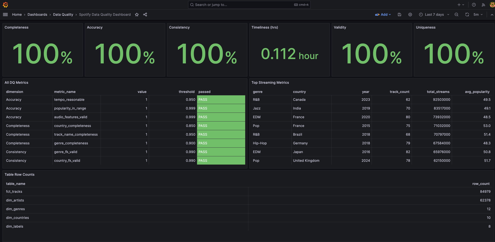

# Spotify Data Quality Pipeline

[](https://github.com)
[](https://github.com)
[](https://airflow.apache.org/)
[](https://www.postgresql.org/)
[](https://grafana.com/)

A **production-ready data pipeline** demonstrating enterprise-grade data quality practices across all 6 DQ dimensions. Built as a portfolio project showcasing expertise in **data engineering**, **data quality**, and **QA automation**.

## Key Highlights

- **141 automated dbt tests** covering data quality, schema validation, and business rules
- **6 Data Quality Dimensions** with real-time monitoring and alerting
- **85,000+ tracks** processed through a complete ELT pipeline
- **Real-time Grafana dashboards** for DQ observability
- **Slack notifications** for instant DQ alerts
- **Fully containerized** with Docker Compose for easy deployment

---

## Architecture

```
┌─────────────────────────────────────────────────────────────────────────────────┐
│                           SPOTIFY DATA QUALITY PIPELINE                         │
└─────────────────────────────────────────────────────────────────────────────────┘

    ┌──────────────┐     ┌──────────────┐     ┌──────────────┐     ┌──────────────┐
    │   KAGGLE     │     │   AIRFLOW    │     │     DBT      │     │   GRAFANA    │
    │   Dataset    │────▶│ Orchestrator │────▶│  Transform   │────▶│  Dashboard   │
    │  (Source)    │     │  (Schedule)  │     │   (Model)    │     │  (Monitor)   │
    └──────────────┘     └──────────────┘     └──────────────┘     └──────────────┘
           │                    │                    │                    │
           ▼                    ▼                    ▼                    ▼
    ┌─────────────────────────────────────────────────────────────────────────────┐
    │                            POSTGRESQL DATABASE                              │
    │  ┌─────────┐  ┌───────────┐  ┌──────────────┐  ┌─────────┐  ┌────────────┐  │
    │  │   RAW   │─▶│  STAGING  │─▶│ INTERMEDIATE │─▶│  MARTS  │─▶│  METRICS   │  │
    │  │ Schema  │  │   Layer   │  │    Layer     │  │  Layer  │  │   Layer    │  │
    │  └─────────┘  └───────────┘  └──────────────┘  └─────────┘  └────────────┘  │
    │       │              │              │              │              │         │
    │       ▼              ▼              ▼              ▼              ▼         │
    │  ┌─────────────────────────────────────────────────────────────────────┐    │
    │  │                     141 DBT TESTS (6 DQ DIMENSIONS)                 │    │
    │  │  ✓ Completeness  ✓ Accuracy  ✓ Consistency  ✓ Timeliness            │    │
    │  │  ✓ Validity      ✓ Uniqueness                                       │    │
    │  └─────────────────────────────────────────────────────────────────────┘    │
    └─────────────────────────────────────────────────────────────────────────────┘
```

### Data Flow

```
┌────────────────────────────────────────────────────────────────────────────────┐
│                              AIRFLOW DAG FLOW                                  │
├────────────────────────────────────────────────────────────────────────────────┤
│                                                                                │
│  ┌───────┐    ┌─────────┐    ┌────────┐    ┌───────────────────────────────┐   │
│  │ START │───▶│ EXTRACT │───▶│  LOAD  │───▶│         DBT TASKS             │   │
│  └───────┘    └─────────┘    └────────┘    │  ┌─────┐ ┌──────┐ ┌───────┐   │   │
│                   │              │         │  │deps │▶│stage │▶│ marts │   │   │
│                   ▼              ▼         │  └─────┘ └──────┘ └───────┘   │   │
│              Download       Load to        │         │                     │   │
│               Kaggle        raw.tracks     │         ▼                     │   │
│               Dataset                      │    ┌─────────┐                │   │
│                                            │    │141 TESTS│                │   │
│                                            │    └─────────┘                │   │
│                                            └───────────────────────────────┘   │
│                                                          │                     │
│                                                          ▼                     │
│                                            ┌─────────────────────────┐         │
│                                            │     QUALITY GATE        │         │
│                                            │  ┌─────────┐ ┌────────┐ │         │
│                                            │  │ PASSED  │ │ FAILED │ │         │
│                                            │  └────┬────┘ └────┬───┘ │         │
│                                            └───────┼───────────┼─────┘         │
│                                                    ▼           ▼               │
│                                            ┌───────────┐  ┌─────────┐          │
│                                            │ REPORTING │  │  ALERT  │          │
│                                            │  & DOCS   │  │  (skip) │          │
│                                            └───────────┘  └─────────┘          │
│                                                    │                           │
│                                                    ▼                           │
│                                               ┌───────┐                        │
│                                               │  END  │                        │
│                                               └───────┘                        │
└────────────────────────────────────────────────────────────────────────────────┘
```

---

## Tech Stack

| Layer | Technology | Purpose |
|-------|------------|---------|
| **Orchestration** | Apache Airflow 2.8+ | DAG scheduling, task dependencies, monitoring |
| **Transformation** | dbt Core 1.7+ | SQL-based ELT, testing framework, documentation |
| **Testing** | dbt-expectations, dbt-utils | 141 automated data quality tests |
| **Database** | PostgreSQL 15 | Data warehouse with dimensional model |
| **Observability** | Grafana 10.2+ | Real-time DQ dashboards, alerting |
| **Alerting** | Slack Webhooks | Instant DQ failure notifications |
| **Infrastructure** | Docker Compose | Containerized deployment |
| **CI/CD** | GitHub Actions | Automated testing, deployment |

---

## Data Quality Framework

### 6 Dimensions Covered

| Dimension | Description | # Tests | Key Metrics |
|-----------|-------------|---------|-------------|
| **Completeness** | Non-null value rates | 23 | track_name: 100%, genre: 100%, country: 100% |
| **Accuracy** | Values within valid ranges | 31 | tempo: 40-250 BPM, energy: 0-1, popularity: 0-100 |
| **Consistency** | Referential integrity | 18 | FK validation to all dimension tables |
| **Timeliness** | Data freshness | 8 | < 48 hours since last update |
| **Validity** | Business rule compliance | 42 | Valid enums, date formats, positive values |
| **Uniqueness** | Duplicate detection | 19 | Unique track_id, composite key validation |

### Real-Time Dashboard



*All 6 DQ dimensions monitored in real-time with pass/fail indicators*

---

## 141 dbt Tests - Complete Breakdown

### Test Summary by Category

| Category | Count | Description |
|----------|-------|-------------|
| **Schema Tests** | 45 | `not_null`, `unique`, `accepted_values` |
| **dbt_expectations** | 52 | Statistical validation, range checks |
| **Relationship Tests** | 12 | Foreign key validation |
| **Source Tests** | 23 | Raw data quality checks |
| **Singular Tests** | 5 | Custom business rule SQL tests |
| **Row Count Tests** | 4 | Table size validation |
| **TOTAL** | **141** | |

### Detailed Test Inventory

<details>
<summary><b>📊 Schema Validation Tests (45 tests)</b></summary>

#### Not Null Tests (25)
| Model | Column | Test |
|-------|--------|------|
| `stg_spotify__tracks` | track_id | `not_null` |
| `stg_spotify__tracks` | track_name | `not_null` |
| `stg_spotify__tracks` | artist_names_raw | `not_null` |
| `stg_spotify__tracks` | genre | `not_null` |
| `stg_spotify__tracks` | country | `not_null` |
| `stg_spotify__tracks` | popularity_score | `not_null` |
| `stg_spotify__tracks` | _dbt_loaded_at | `not_null` |
| `stg_spotify__tracks` | _dbt_run_id | `not_null` |
| `fct_tracks` | track_sk | `not_null` |
| `fct_tracks` | track_id | `not_null` |
| `fct_tracks` | popularity_score | `not_null` |
| `dim_artists` | artist_sk | `not_null` |
| `dim_artists` | artist_name | `not_null` |
| `dim_genres` | genre_sk | `not_null` |
| `dim_genres` | genre_name | `not_null` |
| `dim_countries` | country_sk | `not_null` |
| `dim_countries` | country_code | `not_null` |
| `dim_labels` | label_sk | `not_null` |
| `dim_labels` | label_name | `not_null` |
| `dim_date` | date_sk | `not_null` |
| `dq_metrics_summary` | dimension | `not_null` |
| `dq_metrics_summary` | metric_name | `not_null` |
| `dq_metrics_summary` | metric_value | `not_null` |
| `dq_metrics_summary` | passed | `not_null` |
| `fct_streaming_metrics` | metric_sk | `not_null` |

#### Unique Tests (12)
| Model | Column | Test |
|-------|--------|------|
| `stg_spotify__tracks` | track_id | `unique` |
| `fct_tracks` | track_sk | `unique` |
| `fct_tracks` | track_id | `unique` |
| `dim_artists` | artist_sk | `unique` |
| `dim_genres` | genre_sk | `unique` |
| `dim_genres` | genre_name | `unique` |
| `dim_countries` | country_sk | `unique` |
| `dim_countries` | country_code | `unique` |
| `dim_labels` | label_sk | `unique` |
| `dim_labels` | label_name | `unique` |
| `dim_date` | date_sk | `unique` |
| `fct_streaming_metrics` | metric_sk | `unique` |

#### Accepted Values Tests (8)
| Model | Column | Valid Values |
|-------|--------|--------------|
| `stg_spotify__tracks` | popularity_tier | Very Popular, Popular, Moderate, Low, Very Low |
| `stg_spotify__tracks` | tempo_category | Slow, Moderate, Fast, Very Fast |
| `stg_spotify__tracks` | energy_category | Low Energy, Medium Energy, High Energy |
| `dim_artists` | artist_tier | Top Tier, Established, Rising, Emerging |
| `dim_artists` | streaming_tier | Billion+, 100M+, 10M+, 1M+, Under 1M |
| `dim_genres` | genre_profile | High Energy Dance, Instrumental, Melancholic, etc. |
| `dim_labels` | label_tier | Major Label, Mid-Size Label, Indie Label, Micro Label |
| `fct_tracks` | popularity_tier | Very Popular, Popular, Moderate, Low, Very Low |

</details>

<details>
<summary><b>📈 dbt_expectations Tests (52 tests)</b></summary>

#### Range Validation Tests
| Model | Column | Min | Max | Description |
|-------|--------|-----|-----|-------------|
| `stg_spotify__tracks` | energy | 0.0 | 1.0 | Normalized audio feature |
| `stg_spotify__tracks` | danceability | 0.0 | 1.0 | Normalized audio feature |
| `stg_spotify__tracks` | instrumentalness | 0.0 | 1.0 | Normalized audio feature |
| `stg_spotify__tracks` | loudness_db | -60 | 5 | Audio loudness in dB |
| `stg_spotify__tracks` | tempo_bpm | 40 | 250 | Beats per minute |
| `stg_spotify__tracks` | popularity_score | 0 | 100 | Spotify popularity metric |
| `stg_spotify__tracks` | mood_score | 0.0 | 1.0 | Derived mood indicator |
| `stg_spotify__tracks` | release_year | 2015 | 2025 | Valid year range |
| `stg_spotify__tracks` | release_month | 1 | 12 | Valid month range |
| `fct_tracks` | energy | 0.0 | 1.0 | Normalized audio feature |
| `fct_tracks` | danceability | 0.0 | 1.0 | Normalized audio feature |
| `fct_tracks` | popularity_score | 0 | 100 | Spotify popularity metric |
| `fct_tracks` | streaming_counts | 0 | - | Positive stream counts |
| `fct_tracks` | mood_score | 0.0 | 1.0 | Derived mood indicator |
| `dim_date` | year | 2015 | 2025 | Valid year range |
| `dim_date` | month | 1 | 12 | Valid month range |
| `dim_date` | quarter | 1 | 4 | Valid quarter range |
| `dim_genres` | avg_popularity | 0 | 100 | Genre average popularity |
| `dim_genres` | track_count | 1 | - | At least 1 track per genre |

#### Statistical Tests
| Model | Test Type | Description |
|-------|-----------|-------------|
| `stg_spotify__tracks` | `expect_table_row_count_to_be_between` | 1,000 - 200,000 rows |
| `stg_spotify__tracks` | `expect_row_values_to_have_recent_data` | Data within 7 days |
| `stg_spotify__tracks` | `expect_column_distinct_count_to_be_less_than` | Genre < 100 values |
| `int_tracks__deduplicated` | `expect_table_row_count_to_be_between` | After dedup validation |
| `int_tracks__enriched` | `expect_table_row_count_to_equal_other_table` | Row count consistency |
| `fct_tracks` | `expect_table_row_count_to_be_between` | Final fact table size |
| `fct_tracks` | `expect_table_row_count_to_equal_other_table` | Match with staging |
| `dq_metrics_summary` | `expect_table_row_count_to_be_between` | 10-50 metrics expected |

#### Source Data Tests
| Source | Column | Test |
|--------|--------|------|
| `raw.spotify_tracks_raw` | track_name | `expect_column_values_to_not_be_null` |
| `raw.spotify_tracks_raw` | artist_name | `expect_column_values_to_not_be_null` |
| `raw.spotify_tracks_raw` | energy | `expect_column_values_to_be_between` (0-1) |
| `raw.spotify_tracks_raw` | danceability | `expect_column_values_to_be_between` (0-1) |
| `raw.spotify_tracks_raw` | instrumentalness | `expect_column_values_to_be_between` (0-1) |
| `raw.spotify_tracks_raw` | tempo | `expect_column_values_to_be_between` (40-250) |
| `raw.spotify_tracks_raw` | loudness | `expect_column_values_to_be_between` (-60 to 5) |
| `raw.spotify_tracks_raw` | popularity | `expect_column_values_to_be_between` (0-100) |
| `raw.spotify_tracks_raw` | stream_count | `expect_column_values_to_be_between` (≥0) |
| `raw.spotify_tracks_raw` | genre | `expect_column_distinct_count_to_be_less_than` (100) |
| `raw.spotify_tracks_raw` | country | `expect_column_distinct_count_to_be_less_than` (200) |
| `raw.spotify_tracks_raw` | popularity | `expect_column_mean_to_be_between` (10-80) |
| `raw.spotify_tracks_raw` | tempo | `expect_column_mean_to_be_between` (80-160) |
| `raw.spotify_tracks_raw` | energy | `expect_column_median_to_be_between` (0.2-0.9) |
| `raw.spotify_tracks_raw` | stream_count | `expect_column_quantile_values_to_be_between` (99th percentile) |
| `raw.spotify_tracks_raw` | track_name | `expect_column_value_lengths_to_be_between` (1-500) |
| `raw.spotify_tracks_raw` | artist_name | `expect_column_value_lengths_to_be_between` (1-1000) |

</details>

<details>
<summary><b>🔗 Relationship Tests (12 tests)</b></summary>

| Fact Table | Foreign Key | Dimension Table | Test |
|------------|-------------|-----------------|------|
| `fct_tracks` | genre_sk | `dim_genres.genre_sk` | `relationships` |
| `fct_tracks` | country_sk | `dim_countries.country_sk` | `relationships` |
| `fct_tracks` | label_sk | `dim_labels.label_sk` | `relationships` |

#### Composite Key Tests
| Model | Columns | Test |
|-------|---------|------|
| `stg_spotify__tracks` | track_id | `dbt_utils.unique_combination_of_columns` |
| `int_tracks__deduplicated` | track_id | `dbt_utils.unique_combination_of_columns` |
| `int_tracks__enriched` | track_id | `dbt_utils.unique_combination_of_columns` |
| `int_artists__parsed` | artist_id | `dbt_utils.unique_combination_of_columns` |
| `dim_genres` | genre_name | `dbt_utils.unique_combination_of_columns` |
| `fct_streaming_metrics` | genre, country, release_year | `dbt_utils.unique_combination_of_columns` |

</details>

<details>
<summary><b>🧪 Singular Tests - Custom Business Rules (5 tests)</b></summary>

| Test | File | Business Rule |
|------|------|---------------|
| `assert_audio_features_bounded` | `tests/singular/assert_audio_features_bounded.sql` | All normalized audio features (energy, danceability, valence) must be between 0 and 1 |
| `assert_release_date_valid` | `tests/singular/assert_release_date_valid.sql` | Release year must be between 2015 and 2025 (dataset scope) |
| `assert_streaming_counts_positive` | `tests/singular/assert_streaming_counts_positive.sql` | Stream counts cannot be negative |
| `assert_tempo_reasonable` | `tests/singular/assert_tempo_reasonable.sql` | Tempo (BPM) must be between 40 and 250 |
| `assert_no_orphan_tracks` | `tests/singular/assert_no_orphan_tracks.sql` | All tracks must have valid FK references to dimension tables |

#### Example: `assert_audio_features_bounded.sql`
```sql
-- Ensures all normalized audio features are within valid 0-1 range
SELECT track_id, energy, danceability, valence
FROM {{ ref('fct_tracks') }}
WHERE energy < 0 OR energy > 1
   OR danceability < 0 OR danceability > 1
   OR valence < 0 OR valence > 1
```

</details>

<details>
<summary><b>✅ Intermediate Layer Tests (19 tests)</b></summary>

| Model | Test | Description |
|-------|------|-------------|
| `int_tracks__deduplicated` | `accepted_values_duplicate_rank__1` | Only rank 1 records kept |
| `int_tracks__deduplicated` | `unique_track_id` | No duplicates after dedup |
| `int_tracks__deduplicated` | `not_null_track_id` | All records have ID |
| `int_tracks__deduplicated` | `not_null_had_duplicates` | Dedup flag populated |
| `int_tracks__enriched` | `unique_track_id` | Uniqueness preserved |
| `int_tracks__enriched` | `not_null_is_genre_hit` | Derived field populated |
| `int_tracks__enriched` | `accepted_values_audio_profile` | Valid audio profile categories |
| `int_tracks__enriched` | `accepted_values_streaming_tier` | Valid streaming tier values |
| `int_tracks__enriched` | `accepted_values_release_decade` | Valid decade categories |
| `int_tracks__enriched` | `expect_column_values_to_be_between_popularity_percentile` | 0-100 range |
| `int_tracks__enriched` | `expect_column_values_to_be_between_streaming_percentile` | 0-100 range |
| `int_artists__parsed` | `unique_artist_id` | Unique artist records |
| `int_artists__parsed` | `not_null_artist_name` | Artist name required |
| `int_artists__parsed` | `accepted_values_artist_tier` | Valid tier categories |
| `int_artists__parsed` | `expect_column_values_to_be_between_avg_popularity` | 0-100 range |
| `int_artists__parsed` | `expect_column_values_to_be_between_track_count` | ≥1 tracks |

</details>

---

## Dimensional Model

```
                    ┌─────────────────┐
                    │   dim_date      │
                    │─────────────────│
                    │ date_sk (PK)    │
                    │ year            │
                    │ month           │
                    │ quarter         │
                    │ decade          │
                    └────────┬────────┘
                             │
┌─────────────────┐          │          ┌─────────────────┐
│   dim_genres    │          │          │  dim_countries  │
│─────────────────│          │          │─────────────────│
│ genre_sk (PK)   │          │          │ country_sk (PK) │
│ genre_name      │          │          │ country_code    │
│ genre_profile   │          │          │ country_name    │
│ avg_popularity  │          │          │ market_tier     │
│ track_count     │          │          │ track_count     │
└────────┬────────┘          │          └────────┬────────┘
         │                   │                   │
         │    ┌──────────────┴──────────────┐    │
         │    │        fct_tracks           │    │
         │    │──────────────────────-──────│    │
         └───▶│ track_sk (PK)               │◀───┘
              │ track_id                    │
              │ genre_sk (FK)               │◀───┐
              │ country_sk (FK)             │    │
              │ label_sk (FK)               │◀───┼───┐
              │ popularity_score            │    │   │
              │ streaming_counts            │    │   │
              │ energy, danceability        │    │   │
              │ tempo_bpm, loudness_db      │    │   │
              │ popularity_tier             │    │   │
              └─────────────────────────────┘    │   │
                                                 │   │
┌─────────────────┐                              │   │
│   dim_artists   │                              │   │
│─────────────────│                              │   │
│ artist_sk (PK)  │                              │   │
│ artist_name     │                              │   │
│ artist_tier     │                              │   │
│ streaming_tier  │                              │   │
│ total_streams   │──────────────────────────────┘   │
└─────────────────┘                                  │
                                                     │
┌─────────────────┐                                  │
│   dim_labels    │                                  │
│─────────────────│                                  │
│ label_sk (PK)   │                                  │
│ label_name      │                                  │
│ label_tier      │                                  │
│ track_count     │──────────────────────────────────┘
└─────────────────┘
```

---

## Quick Start

### Prerequisites

- Docker Desktop 4.0+
- Python 3.11+
- Make (pre-installed on macOS/Linux)
- Kaggle API credentials ([Get yours here](https://kaggle.com/account))

### 1. Clone and Setup

```bash
git clone https://github.com/operator13/spotify-datapipeline.git
cd spotify-datapipeline

# Configure environment variables
cp .env.example .env

# Edit .env and add your Kaggle API token:
# 1. Go to https://kaggle.com/account
# 2. Scroll to "API" section → Click "Create New Token"
# 3. Open the downloaded kaggle.json and copy the "key" value
# 4. Paste it in .env as KAGGLE_API_TOKEN=your_token_here
```

### 2. Start Services

```bash
# Start all services (PostgreSQL, Airflow, Grafana)
make up

# Or manually with docker compose:
# cd docker && docker compose up -d

# Verify services are running
make ps
```

### 3. Access UIs

| Service | URL | Credentials |
|---------|-----|-------------|
| **Airflow** | http://localhost:8080 | admin / admin |
| **Grafana** | http://localhost:3000 | admin / admin |
| **PostgreSQL** | localhost:5432 | spotify / spotify_password |

### 4. Run the Pipeline

1. Open Airflow UI → Enable `spotify_etl_pipeline` DAG
2. Click "Trigger DAG" or wait for daily schedule
3. Monitor in Graph view → All tasks should turn green
4. View results in Grafana dashboard

### 5. Reset Database (if needed)

```bash
# Reset database (clears all data)
make reset-db
# or: ./scripts/reset_database.sh

# Restart services to pick up any .env changes
make down && make up
# or: cd docker && docker compose down && docker compose up -d
```

### 6. Data Exploration (Jupyter Notebook)

Interactive notebook for viewing tables and running ad-hoc analysis:

```bash
# Launch Jupyter notebook
make notebook
```

**Features:**
- Data Quality metrics visualization
- Table row counts overview
- Top tracks and streaming analysis
- Audio features correlation matrix
- Custom SQL queries

Open `notebooks/data_exploration.ipynb` to explore the data warehouse interactively.

---

## Project Structure

```
spotify_datapipeline/
├── airflow/
│   ├── dags/
│   │   ├── spotify_etl_dag.py          # Main ETL (daily)
│   │   └── data_quality_dag.py         # DQ monitoring (4-hourly)
│   └── Dockerfile
├── dbt/spotify_dq/
│   ├── models/
│   │   ├── staging/                    # Raw → Clean
│   │   │   ├── stg_spotify__tracks.sql
│   │   │   └── _staging.yml            # 23 source tests
│   │   ├── intermediate/               # Business logic
│   │   │   ├── int_tracks__deduplicated.sql
│   │   │   ├── int_tracks__enriched.sql
│   │   │   └── int_artists__parsed.sql
│   │   └── marts/
│   │       ├── core/                   # Dimensional model
│   │       │   ├── fct_tracks.sql
│   │       │   ├── dim_genres.sql
│   │       │   ├── dim_artists.sql
│   │       │   ├── dim_countries.sql
│   │       │   └── dim_labels.sql
│   │       └── analytics/
│   │           └── dq_metrics_summary.sql
│   ├── tests/singular/                 # 5 custom business rules
│   ├── macros/data_quality/            # Reusable test macros
│   ├── seeds/                          # Reference data
│   └── dbt_project.yml
├── docker/
│   ├── docker-compose.yml
│   ├── postgres/init-scripts/
│   └── grafana/provisioning/
├── scripts/
│   └── reset_database.sh
├── notebooks/
│   └── data_exploration.ipynb        # Interactive data analysis
└── docs/
    └── DATA_QUALITY_TROUBLESHOOTING.md
```

---

## Make Commands

Run `make help` to see all available commands.

### Infrastructure
```bash
make up              # Start all Docker services (PostgreSQL, Airflow, Grafana)
make down            # Stop all Docker services
make restart         # Restart all services
make logs            # View container logs (follow mode)
make ps              # Show running containers
make clean           # Remove containers, volumes, and images
```

### dbt Commands
```bash
make dbt-deps        # Install dbt packages
make dbt-seed        # Load seed data
make dbt-run         # Run all dbt models
make dbt-test        # Run all 141 dbt tests
make dbt-docs        # Generate and serve dbt documentation
make dbt-fresh       # Full refresh (deps → seed → run → test)
```

### Development
```bash
make setup           # Initial project setup (venv + dependencies)
make lint            # Run SQLFluff and YAML linting
make venv            # Create Python virtual environment
```

### Utilities
```bash
make psql            # Connect to PostgreSQL database
make trigger-etl     # Trigger the ETL pipeline in Airflow
make download-data   # Download Kaggle dataset
```

---

## Grafana Dashboard Panels

| Panel | Metric | Threshold | Description |
|-------|--------|-----------|-------------|
| **Completeness** | AVG of completeness metrics | ≥95% | Non-null critical fields |
| **Accuracy** | AVG of accuracy metrics | ≥99% | Values in valid ranges |
| **Consistency** | AVG of FK validity | ≥99% | Valid dimension references |
| **Timeliness** | Hours since update | ≤48h | Data freshness |
| **Validity** | AVG of business rules | ≥99% | Enum/format compliance |
| **Uniqueness** | Duplicate ratio | =100% | No duplicate records |
| **All DQ Metrics** | 13 individual metrics | Various | Detailed breakdown |
| **Table Row Counts** | Row counts | - | Data volume monitoring |

---

## Slack Notifications

Real-time Slack alerts notify your team immediately when data quality issues are detected.

### Alert Types

| Status | Message | Description |
|--------|---------|-------------|
| :white_check_mark: **Passed** | "Data Quality Check Passed" | All metrics within acceptable thresholds |
| :warning: **Alert** | "Data Quality Alert" | Issues detected requiring attention |

### Sample Alerts

**When all checks pass:**
```
✅ Data Quality Check Passed 🎉

✨ All metrics within acceptable thresholds.

Pipeline: spotify_etl
Time: 2025-12-12 03:45:00 UTC
Dashboard: View Grafana Dashboard
```

**When issues are detected:**
```
🚨 Data Quality Alert ⚠️

❌ 2 issue(s) detected:
• SLA VIOLATION: Data is 52.3 hours stale (SLA: 24h)
• LOW COMPLETENESS: genre_ratio = 85.00%

Pipeline: spotify_etl
Time: 2025-12-12 03:45:00 UTC
Dashboard: View Grafana Dashboard
```

### Setup Slack Integration

1. **Create Slack Incoming Webhook**
   - Go to https://api.slack.com/messaging/webhooks
   - Create a new app → Enable Incoming Webhooks
   - Add webhook to your desired channel (e.g., `#data-quality-alerts`)
   - Copy the webhook URL

2. **Configure Environment Variable**
   ```bash
   # Add to your .env file
   SLACK_WEBHOOK_URL=https://hooks.slack.com/services/T.../B.../xxx
   ```

3. **Rebuild Docker (first time only)**
   ```bash
   cd docker && docker compose down && docker compose up --build -d
   ```

4. **Trigger Alerts**
   - Alerts are sent automatically by the `data_quality_monitoring` DAG (runs every 4 hours)
   - Manually trigger: Airflow UI → `data_quality_monitoring` → Trigger DAG

### Alert Conditions

| Metric Type | Threshold | Alert Triggered When |
|-------------|-----------|---------------------|
| Completeness ratios | < 90% | Critical fields have too many nulls |
| Accuracy ratios | < 90% | Values outside expected ranges |
| Duplicate ratio | > 10% | Too many duplicate records |
| SLA compliance | > 24 hours | Data is stale |

### How DQ Failures Are Stored

When dbt tests fail, the failing records are stored in PostgreSQL for investigation:

```
┌─────────────────────────────────────────────────────────────────────────────────┐
│                         DQ FAILURE DETECTION FLOW                               │
└─────────────────────────────────────────────────────────────────────────────────┘

    dbt test --store-failures
              │
              ▼
    ┌─────────────────────────────────────────────────────────────────────────┐
    │                    staging_data_quality schema                          │
    │  ┌─────────────────────────────────────────────────────────────────┐    │
    │  │  Tables created automatically for each failing test:            │    │
    │  │                                                                 │    │
    │  │  • source_not_null_spotify_raw_tracks_track_name (21 rows)      │    │
    │  │  • dbt_expectations_source_expect_27d2bc79e... (46 rows)        │    │
    │  │  • [any new failing test creates a new table]                   │    │
    │  └─────────────────────────────────────────────────────────────────┘    │
    └─────────────────────────────────────────────────────────────────────────┘
              │
              ▼
    ┌─────────────────────────────────────────────────────────────────────────┐
    │  data_quality.get_dbt_test_failures() function                          │
    │  Dynamically discovers ALL failure tables with row counts               │
    └─────────────────────────────────────────────────────────────────────────┘
              │
              ├──────────────────────┬──────────────────────┐
              ▼                      ▼                      ▼
    ┌──────────────────┐   ┌─────────────────-─┐   ┌──────────────────┐
    │  Slack Alerts    │   │ Grafana Dashboard │   │  Direct Query    │
    │  (Automated)     │   │ (Real-time)       │   │  (Ad-hoc)        │
    └──────────────────┘   └────────────────-──┘   └──────────────────┘
```

**Database Schemas:**

| Schema | Purpose |
|--------|---------|
| `raw` | Raw source data loaded from Kaggle |
| `staging_marts` | dbt models (staging, intermediate, marts) |
| `data_quality` | Custom DQ metrics and monitoring tables |
| `staging_data_quality` | dbt test failure records (auto-created) |

**Querying Failed Records:**

```sql
-- View all current test failures
SELECT * FROM data_quality.get_dbt_test_failures();

-- Inspect specific failing records (example: NULL track names)
SELECT * FROM staging_data_quality.source_not_null_spotify_raw_tracks_track_name;

-- List all failure tables
SELECT table_name
FROM information_schema.tables
WHERE table_schema = 'staging_data_quality';
```

**Key Points:**
- Failure tables persist until manually dropped or tests pass
- New failures automatically create new tables
- Both Slack and Grafana use the same dynamic detection function
- Useful for root cause analysis of data quality issues

---

## CI/CD Pipeline

### Pull Request Checks
- SQLFluff SQL linting
- YAML validation
- `dbt compile` - Parse all models
- `dbt test` - Run 141 tests against test DB
- Docker build validation

### Deployment (on merge)
- Build and push Docker images
- Deploy to target environment
- Post-deployment health checks

---

## Skills Demonstrated

| Category | Skills |
|----------|--------|
| **Data Engineering** | ELT pipelines, dimensional modeling, SQL optimization |
| **Data Quality** | 6 DQ dimensions, automated testing, anomaly detection |
| **Orchestration** | Airflow DAGs, task dependencies, error handling |
| **dbt** | Models, tests, macros, seeds, documentation |
| **DevOps** | Docker, CI/CD, infrastructure as code |
| **Observability** | Grafana dashboards, metrics, alerting |

---

## Author

**Data Engineering Portfolio Project**
Demonstrating enterprise-grade data quality practices for QA Lead / Data Engineering roles.

---

## License

MIT License - See [LICENSE](LICENSE) for details.
